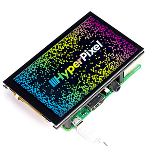
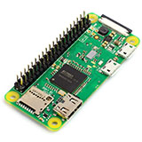
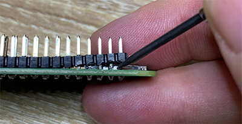
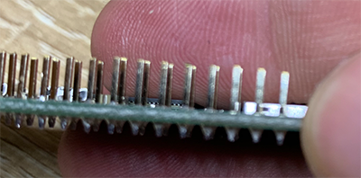
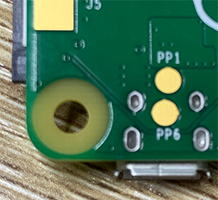
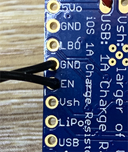
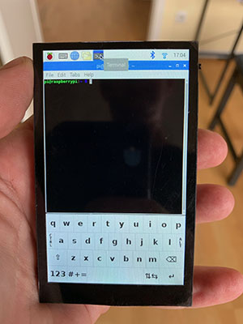

# Hyper-pi

#### Making a usable handheld device using a Raspberry Pi Zero and a HyperPixel 4" capacitive touch screen.

&nbsp;

## About this project

### Introduction

Mobile phones are great, but all those features come at a price. With each passing year, the walls of the Google or Apple-owned gardens are closing in on us. We have no control over the sofwtare that runs on our phones. Wouldn't it be cool to have a networked device that fits in your pocket where you control what software runs on it? As it turns out: no amount of homebrew hacking can match the commercial products, but by combining and tinkering with some available products we can create something that is mighty small and (at least to me) surprisingly usable for some purposes. It's by no means a phone, but it is a start towards some kind of open communicator.

The end product is a device that centers on the Hyperpixel 4" 800x480 pixels capacitive touch screen. That screen sells with a circuit board that allows you to plug a full-sized Raspberry Pi into it, but we plug in the much smaller Raspberry Pi Zero instead.

### Current stage: prototyping

This is unfinished work: a 3D-printed enclosure is in the works and currently this describes how to build a wired up tabletop prototype of the components that are scheduled to go into the first version of the enclosure. At this stage, this project might be for you if you like tinkering with linux, can solder wires onto circuit boards and can spare something like 150 euros on something that is fun to play with but may or may not be actually useful to you.

&nbsp;

## Hardware

### Buying the components

* At Pimoroni, order a [Hyperpixel 4.0 touch screen](https://shop.pimoroni.com/products/hyperpixel-4?variant=12569485443155) (GBP 42.50) and a [Raspberry Pi Zero WH](https://shop.pimoroni.com/products/raspberry-pi-zero-wh-with-pre-soldered-header) (GBP 13.02).<br>[](https://shop.pimoroni.com/products/hyperpixel-4?variant=12569485443155) [](https://shop.pimoroni.com/products/raspberry-pi-zero-wh-with-pre-soldered-header)

* Pimoroni also has SD-cards, but I got a [Sandisk Extreme Pro 64GB](https://www.amazon.de/gp/product/B07G3GMRYF/ref=ppx_yo_dt_b_asin_title_o02_s00?ie=UTF8&psc=1) (EUR 22.99) on Amazon because the faster the card the faster the Pi boots and the differences between cards can be quite striking.<br>[](https://www.amazon.de/gp/product/B07G3GMRYF/ref=ppx_yo_dt_b_asin_title_o02_s00?ie=UTF8&psc=1)

* Next, at Adafruit you'll want to order a [2500 mAh Lithium Polymer battery](https://www.adafruit.com/product/328) (USD 14.95) and a [PowerBoost 1000C battery charging and voltage boost circuit](https://learn.adafruit.com/adafruit-powerboost-1000c-load-share-usb-charge-boost) (USD 19.95).<br>[](https://www.adafruit.com/product/328) [](https://learn.adafruit.com/adafruit-powerboost-1000c-load-share-usb-charge-boost)

* Even in a prototype, you don't want to wear out your connectors by plugging in and out USB and battery all the time, so you'll need a small switch to turn the thing on and off. We selected [this one](https://www.mouser.de/ProductDetail/e-switch/eg1248/?qs=f57gQzlyLioiw9IGENOORA==) (EUR 0.60) that will eventually fit our 3D-printed case. (All these prices are excluding shipping. Please don't buy just one switch, you'll hate yourself if it breaks when you solder wires to it.)<br>[](https://www.mouser.de/ProductDetail/e-switch/eg1248/?qs=f57gQzlyLioiw9IGENOORA==)

All these places deliver quickly, usually within just a few days. While you wait for the stuff to arrive, you may want to learn more about Raspberry Pi and Raspbian (the Debian based Linux operating system that we will use) as well as read the description of the Adafruit PowerBoost 1000C thing. (It's essentially the guts of a USB-in USB-out power bank where you plug in a battery of your choice.)

As for your tools / workspace: You will need to be set up to solder and have some thin insulated multicore wires, [small diagonal clippers](https://www.amazon.de/gp/product/B0000WRPMY/ref=ppx_yo_dt_b_asin_title_o00_s00?ie=UTF8&psc=1) and a very small flat [watchmaker screwdriver](https://www.amazon.de/Fixapart-Tools-Uhrmacher-Schraubendreher-Satz-ASS-1101SUPER/dp/B009X261J0/ref=sr_1_4). And you will need a [way](https://www.amazon.de/UGREEN-Kartenleser-Kartenlesegerät-gleichzeitige-Auslesung/dp/B0779V61XB/ref=sr_1_8) to hook up an SD-card to your computer.

&nbsp;

### Building the prototype

Once you have all the stuff it's time to get going. 

The screen is made to be on top of a full size Raspberry Pi, which has huge connectors (USB, Ethernet) sitting on it. Since we want our eventual device to be small, we want the Pi Zero to be snug and close to the screen. This is hard because the pins are too long, and the plastic of the header connector is in the way.


 
At this point, take a small screwdriver and very carefully pry off the black plastic bar on the header connector.



Now use the angled clippers to clip off the heaer connector pins until about 5mm of each pin is left.



Next we will solder on the power wires. Twist together some red and black insulated wire, and solder it on the two test points at the back of the micro-USB connector marked PWR on the board as shown. (Sometimes these points are labelled PP1 and PP6, sometimes they are not.) Just make sure the plus (red) and minus (black) are not swapped. As you can see we used the mounting hole as strain relief in this prototype.

&nbsp;&nbsp;&nbsp;&nbsp;&nbsp;

Next we take the other end of the power wires and solder them to the Adafruit Powerboost board as shown.

&nbsp;&nbsp;&nbsp;&nbsp;&nbsp;

Now we take two new pieces of wire (can both be black), twist them together and solder one end to two pins on the switch. Can be the left and middle or the right and the middle pin. On the other side, solder thse wires to the GND and EN contacts on the Powerboost board as shown. Because the Powerboost has an enable pin, the true power to the Pi, screen and eventual USB accessories never flows through the switch: the EN (enable) is only an input that turns the power boost circuit on and off.

&nbsp;&nbsp;&nbsp;&nbsp;&nbsp;

After you carefully plug the Pi Zero into the display, you should now have a tabletop prototype that looks something like the rig in the picture below.


And if you want to see what it will look and feel like after we have an enclosure, simply use some double-stick tape and some electrical tape to stick these components together.

&nbsp;&nbsp;&nbsp;&nbsp;&nbsp;

&nbsp;


## Software

### Prepare the SD-card

At first the screen is not going to work. What that means is that we want to prepare the Pi for "headless" operation, meaning it can work without a monitor and keyboard attached. Here's the steps to create an SD-card that will instruct the Pi to boot, connect to your wifi and start an ssh daemon for you to log in over the wifi.

* Insert your SD-card in a reader on your computer

* Get a Raspbian image from [here](https://www.raspberrypi.org/downloads/raspbian/).

* Follow the instructions to burn it on the SD card. For Windows, Mac and Linux, the easiest way is to download and use [balenaEtcher](https://www.balena.io/etcher/), it's all pretty self-explanatory.

* When the image is on the SD-card you may have to pull it out and stick it back in for the OS to mount the card. It should show an MS-DOS FAT32 volume named "boot". In the root directory of this volume, you will need to create an empty file called 'ssh', and a text file named 'wpa_supplicant.conf'. In terminal on the Mac one would do:<br><br>`cd /Volumes/boot`<br>`touch ssh`<br>`nano wpa_supplicant.conf`<br>

* In `wpa_supplicant.conf`, you need to place the text below, replacing 'TWO-LETTER-COUNTRY-CODE' with the country code (eg. 'NL' or 'DE'), 'SSID' with your wifi SSID and 'PASSWORD' with your wifi password.

```
ctrl_interface=DIR=/var/run/wpa_supplicant GROUP=netdev
update_config=1
country=TWO-LETTER-COUNTRY-CODE

network={
	ssid="SSID"
	psk="PASSWORD"
	key_mgmt=WPA-PSK
}
```

### Starting the Pi

* Now is the time to eject the SD-card and insert it in the Pi.

* Turn on the Pi. You'll see the led come on, but nothing will happen on the screen. You can try pinging the pi from your computer using `ping raspberrypi.local` or (sometimes .local doesn't work) try to figure out what IP number it got from your router and ping that. The first time it will boot, resize the partition on the SD-card and then boot again, this is normal. After this is all done, it should sit there and wait for you to use ssh to get in. The username is 'pi', the password is 'raspberry'.

* I copy my ssh pubkey to the Pi by executing (on my own Mac):<br><br>`ssh pi@raspberrypi.local 'mkdir .ssh'`<br>`scp ~/.ssh/id_rsa.pub pi@raspberrypi.local:~/.ssh/authorized_keys`<br><br> so I don't have to type a password every time. This step is optional.

* Now use `ssh pi@raspberrypi.local` to log into the Pi and enter `passwd` to change the password. This step is NOT optional.


### Screen drivers

Now let's make the screen work.

* Make sure you are still logged into the Raspberry Pi via ssh

* Install the driver:<br><br>`git clone https://github.com/pimoroni/hyperpixel4`<br>`cd hyperpixel4`<br>`sudo ./install.sh`

* Install dirstributed kernel module support and kernel-headers. (Note: It may seem like it's stuck, but it just takes a while.)<br><br>`sudo apt install dkms raspberrypi-kernel-headers`

* Replace the touch screen driver by an alternative driver that allows for portrait rotations:<br><br>`wget https://github.com/pimoroni/HyperPixel4TouchScreen/releases/download/v1.0/hyperpixel4-goodix-dkms_1.0_all.deb`<br>`sudo dpkg -i hyperpixel4-goodix-dkms_1.0_all.deb`<br>`git clone https://github.com/pimoroni/HyperPixel4TouchScreen`<br>`cd HyperPixel4TouchScreen/driver`<br>`make build`<br>`sudo make install`

* Then replace some of the settings in /boot/config.txt to adjust for portrait rotation:<br><br>`sudo sed -i 's/^dtoverlay=hyperpixel4/dtoverlay=hyperpixel4:rotate_0/g' /boot/config.txt`<br>`sudo sed -i 's/framebuffer_width=800/framebuffer_width=480/g' /boot/config.txt`<br>`sudo sed -i 's/framebuffer_height=480/framebuffer_height=800/g' /boot/config.txt`<br>`sudo sed -i 's/display_rotate=3/display_rotate=0/g' /boot/config.txt`

* Now reboot and wait. Your device should wake up with a working touch screen.<br><br>`sudo reboot`

### On-screen keyboard

To be able to display a keyboard that is really usable on this small screen, we are using a fork of the standard 'matchbox-keyboard' utility that allows different fonts on the keys and different layouts.

* ssh into your Pi again, and install some packages needed to compile the keyboard:<br><br>`sudo apt install libtool autoconf libfakekey-dev libxft-dev`

* Then get and compile the keybaord source.<br><br>`git clone https://github.com/xlab/matchbox-keyboard`<br>`cd  matchbox-keyboard`<br>`./autogen.sh`<br>`make`<br>`sudo make install`

* `sudo nano /usr/share/applications/toggle-matchbox-keyboard.desktop` and put in the following:

```
[Desktop Entry]
Name=Toggle Matchbox Keyboard
Comment=Toggle Matchbox Keyboard
Exec=toggle-matchbox-keyboard.sh
Type=Application
Icon=matchbox-keyboard.png
Categories=Panel;Utility;MB
X-MB-INPUT-MECHANISM=True
```

* `sudo nano /usr/local/bin/toggle-matchbox-keyboard.sh` and put in the following:

```
#!/bin/bash
#This script toggles the virtual keyboard

PID=`pidof matchbox-keyboard`
if [ ! -e $PID ]; then
  killall matchbox-keyboard
else
  MB_KBD_CONFIG=/usr/local/share/matchbox-keyboard/keyboard-pi.xml matchbox-keyboard -g 250 -s 13 -c 0 -r 0 -t &
fi
```

* `sudo chmod a+x /usr/local/bin/toggle-matchbox-keyboard.sh`

* Copy the keyboard definition file and supporting png images:<br><br>`cd ~`<br>`git clone https://github.com/ropg/hyper-pi`<br>`sudo cp hyper-pi/files/keyboard/* /usr/local/share/matchbox-keyboard`
 
### Final configuration

* Our 'panels' file adds the keyboard toggle in the top and sets up the desktop for minimal space: no tray in the top bar, removing some things like audio control and eject button.<br><br>`cp hyper-pi/files/panel /home/pi/.config/lxpanel/LXDE-pi/panels`

* Make lxterminal open a narrower window.<br><br>`sudo sed -i 's/^Exec=lxterminal/Exec=lxterminal --geometry=58x30/g' /usr/share/raspi-ui-overrides/applications/lxterminal.desktop`

* Install 'netsurf', a tiny browser that renders a bit better than chromium on such a narrow display.<br><br>`sudo apt install netsurf`

* Reboot and wait for the system to come back.<br><br>`sudo reboot`